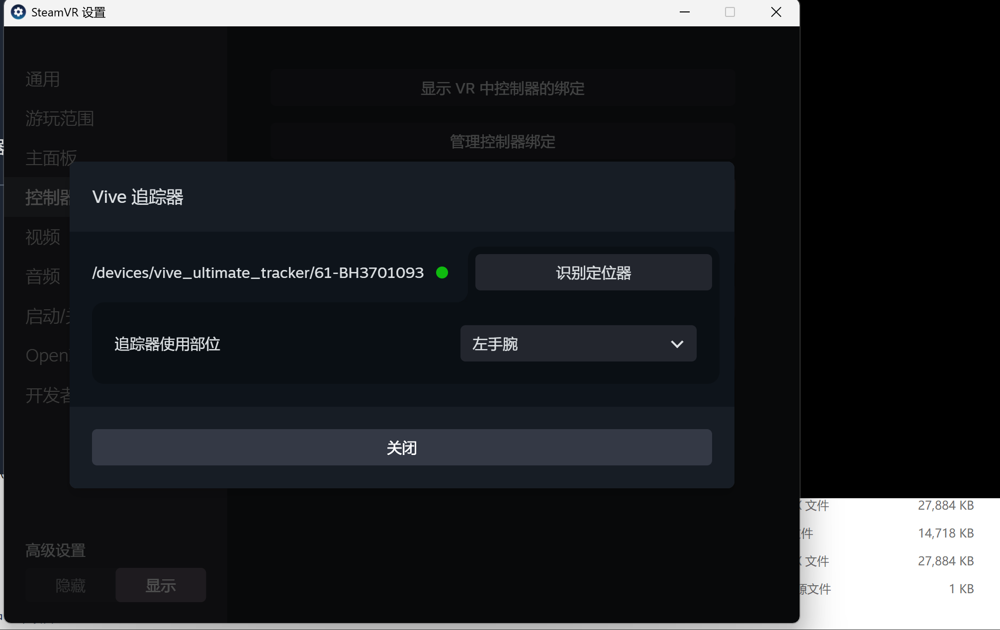

# VIVE Tracker 位姿采集

## 配置

运行环境：

- Windows 10/11
- Steam、SteamVR
- VIVE Hub 及 VIVE Tracker 所需服务
- [uv](https://docs.astral.sh/uv/getting-started/installation/)

请先启动 SteamVR，并确认：

1. SteamVR 已设置为当前 OpenXR 运行时。
2. 所有 Tracker 均已连接且可正常定位。
3. 在 SteamVR 的 **设置 → 控制器 → 管理追踪器** 中，为每个 Tracker 设置与实际佩戴位置对应的角色。

角色设置界面如下：



脚本使用 `uv` 自动准备兼容的 Python（3.10～3.13）及所需依赖，无需手动创建虚拟环境或执行 `pip install`。

## 使用

在本项目目录中打开 PowerShell，并保持 SteamVR 运行。

### 1. 绑定 Tracker 角色

```powershell
.\01_绑定Tracker角色.ps1
```

脚本会读取 SteamVR 当前为所有 Tracker 显式分配的角色，并在项目目录生成 `tracker_roles.json`。角色名称和 Tracker 数量均不固定；Tracker 角色或设备发生变化后，需要重新运行此脚本。

### 2. 开始采集

```powershell
.\02_采集OpenXR_Tracker位姿与触发事件.ps1
```

采样率默认为 120 Hz。需要指定其他采样率时，例如 60 Hz：

```powershell
.\02_采集OpenXR_Tracker位姿与触发事件.ps1 -TrackerRate 60
```

脚本启动后会立即采集；按 `Ctrl+C` 结束并保存。每次采集结果保存在 `vr_captures\vr_capture_时间戳\` 中，包括：

- `tracker_poses.csv`：各 Tracker 的位姿数据
- `metadata.json`：本次采集的运行时、设备及统计信息

如果 PowerShell 阻止本地脚本运行，可在当前窗口执行：

```powershell
Set-ExecutionPolicy -Scope Process Bypass
```
